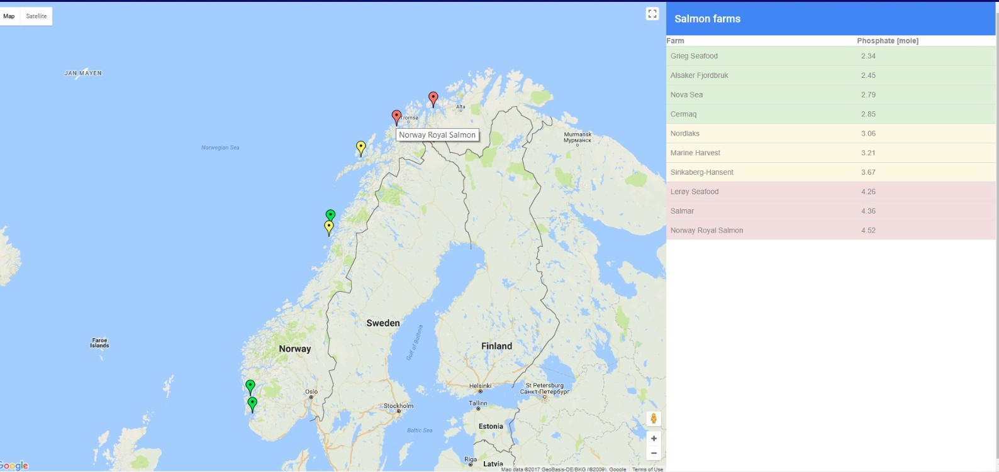

# nerdics-2017

Screenshot of the solution:

Developed using Angular 4 and Google Maps API

Workflow:

1. $ git clone git@github.com:jelenans/nerdics-2017.git
2. $ git fetch
3. $ git rebase origin/master
4. Do the coding....
5. $ git add
6. $ git status
7. $ git commit
8. $ git push origin master

*!Note: If you want to create a separate branch:*

1. $ git clone git@github.com:jelenans/nerdics-2017.git
2. $ git fetch
3. $ git rebase origin/master
4. $ git checkout -b feature/my_feature origin/master
5. Do the coding....
6. $ git add
7. $ git status
8. $ git commit
9. $ git push origin feature/my_feature

